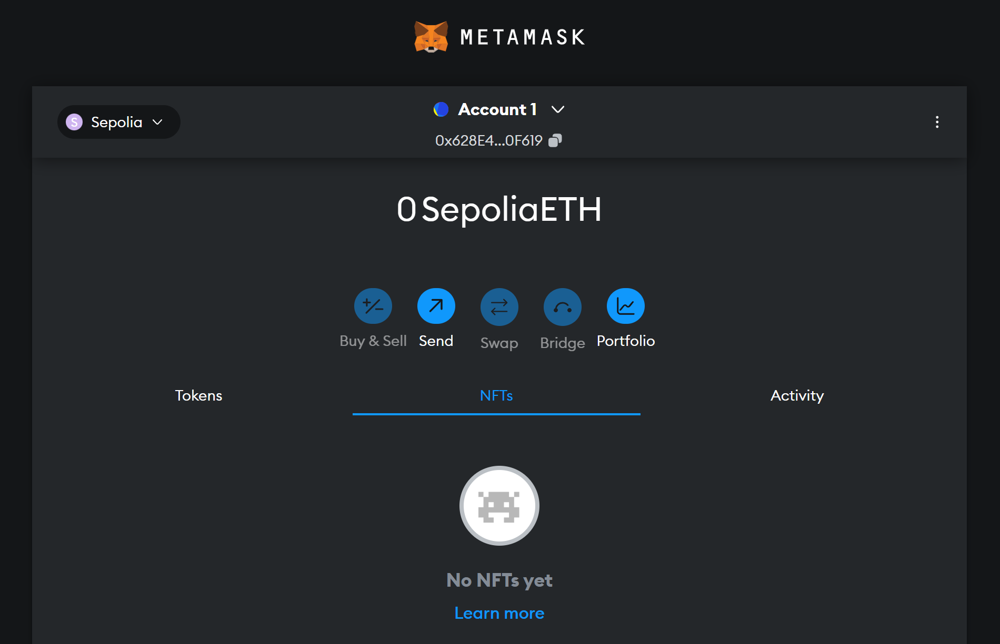
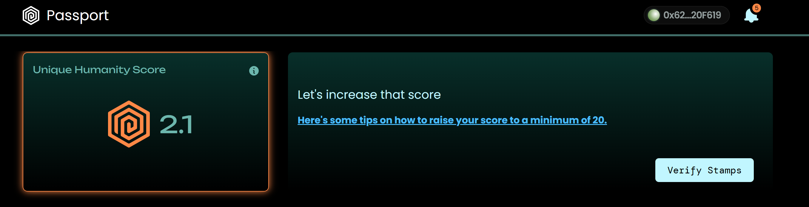

## Tasks Completed
1. Created a MetaMask wallet and added the Sepolia Test Network.
2. Obtained Sepolia ETH from the Google Cloud Sepolia Faucet (Sepolia PoW faucet requires min bal req. before using).
3. Achieved a Gitcoin Passport score of 2+ by completing the identity verification.

## Proof of Completion
### MetaMask Wallet Setup

### Sepolia ETH from Sepolia PoW Faucet

### Gitcoin Passport Score
